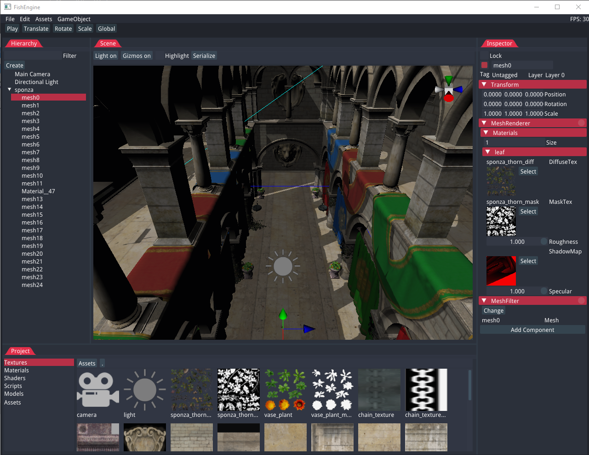
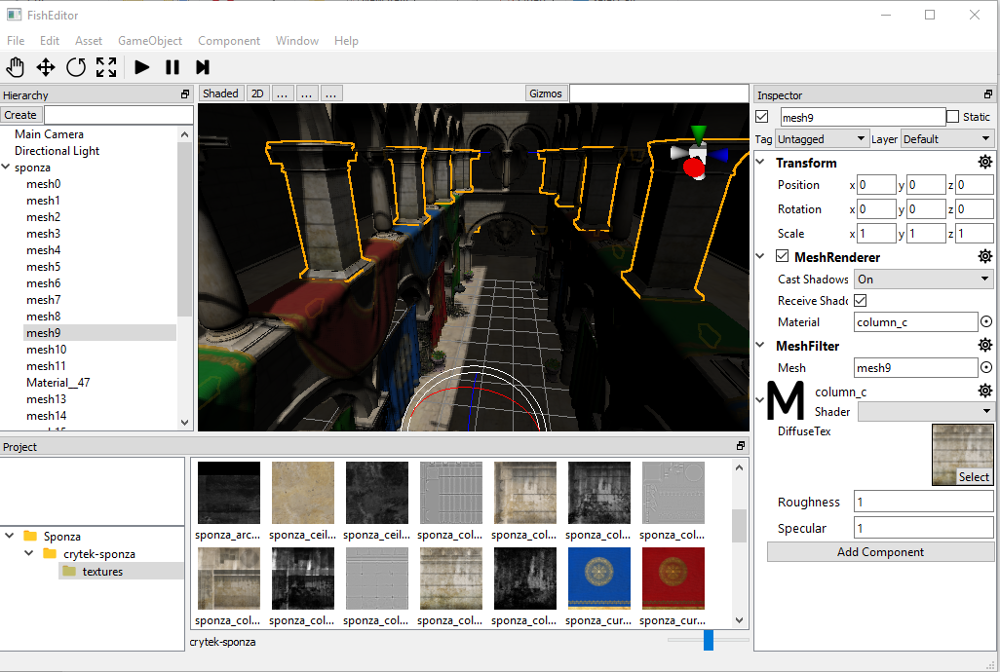

# FishEngine

## What is FishEngine

FishEngine is a simple, Unity-like game engine, mainly written in C++11 (with some C++14 features).






## Features

- Unity-like Editor
- Nearly same API with Unity
- Physically Based Rendering (PBR)
- Asset management (WIP)
- Physics system (WIP)


## Release


## How to Build

Before yout build, you will need to have some additional software installed:

- [Git](http://git-scm.com/downloads).
- [CMake](https://cmake.org/download/). Version 3.0.0 or later is required.
- [Python](https://www.python.org/downloads/). Version 2.7.x is required, 3.x is not officially supported because libclang has no python3 binding.
- [Visual Studio 2015](https://www.visualstudio.com/downloads), Update 3 (Windows only)


And some other 3rd-party libs is required (Or you can download from here[TBA])

**for all platforms:**

​	Download and install Qt5 SDK from https://www.qt.io. My choice is version [5.8.0](http://download.qt.io/official_releases/qt/5.8/5.8.0/qt-opensource-mac-x64-clang-5.8.0.dmg).

​	Download and install PhysX SDK from https://developer.nvidia.com/physx-sdk. You may get source on GitHub and compile by yourself. Current version is 3.3.4.

​	Download and install Autodesk FBX SDK from http://usa.autodesk.com/adsk/servlet/pc/item?siteID=123112&id=26012646. Current version is 2017.1.

**for windows:**

​	download and install [Clang](http://releases.llvm.org/3.9.1/LLVM-3.9.1-win64.exe)


Clone the sources and create a build directory.

```shell
git clone https://github.com/yushroom/FishEngine.git
cd FishEngine/Engine
mkdir build && cd build
```
Use CMake to generate project file using any [desired generator](https://cmake.org/cmake/help/v3.0/manual/cmake-generators.7.html).Replace **Qt5_DIR**, **PhysX_ROOT_DIR** and **FBXSDK_DIR** with yours. Or you can use camke-gui to do the same thing.

```shell
cmake -G "Visual Studio 14 Win64" -DQt5_DIR=D:\Library\Qt\Qt5.8.0\5.8\msvc2015_64\lib\cmake\Qt5 -DPhysX_ROOT_DIR=D:\program\PhysX-3.3\PhysXSDK -DFBXSDK_DIR="D:\Library\FBX SDK\2017.1" ..
```

Finally, you can use any IDE according to you selected generator, but you can also just build straight from CMake. Build results can be found in Engine/Binary.

```shell
cmake --build . --target FishEditor --config Release
```


## 3rd Party Libraries

**for all platforms:**

- [boost](http://www.boost.org/) (filesystem)
- [assimp](https://github.com/assimp/assimp) (3D model importer)
- [Autodesk FBX SDK](http://www.autodesk.com/products/fbx/overview) (.fbx model importer)
- [Qt](https://www.qt.io) (Editor only,  GUI / image loader)
- [gli](https://github.com/g-truc/gli) (dds texture loader) and [glm](https://github.com/g-truc/glm) (required by gli)
- [stb](https://github.com/nothings/stb) (font/image)
- [yaml-cpp](https://github.com/jbeder/yaml-cpp) (serialization)
- [PhysX](https://developer.nvidia.com/physx-sdk) (physics system)


**for MS Windows:**

- [clang](http://www.boost.org/) (c++ reflection)
- [glew](https://github.com/nigels-com/glew) (opengl loader)

